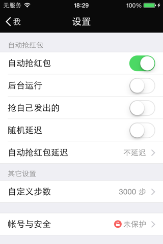
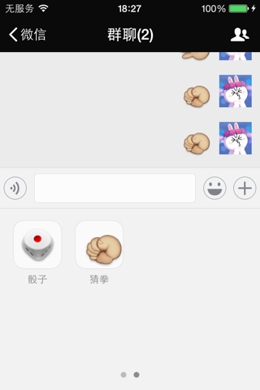

# WeChatTweak-iOS

微信iOS客户端Tweak实现。

## Feature

1. 自动抢红包
   - 随机延时抢红包
   - 后台抢红包
   - 是否抢自己发出的
2. 自定义骰子数
3. 自定义猜拳结果
4. 自定义运动步数

## Requirement

- Xcode
- ldid
- dpkg
- [theos](https://github.com/theos/theos)

## Screenshot

|                设置页面                |              自定义猜拳&骰子              |
| :--------------------------------: | :--------------------------------: |
|  |  |

## License

The [MIT License](LICENSE).
